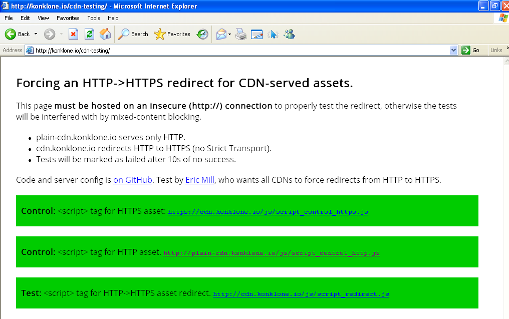

## Moving CDNs to HTTPS

Testing the effects of a 3rd party CDN (e.g. `ajax.googleapis.com` or `cdnjs.com`) forcing HTTPS via a redirect.

> **[http://konklone.io/cdns-to-https](http://konklone.io/cdns-to-https)**

* Will `<script>` tags to `http://` successfully follow a 301 redirect to `https://`?
* Will CORS requests to `http://` successfully follow a 301 redirect to `https://`?
* Is there a good reason to do this?

The answer to all of these is **Yes.**

Jump to the [tests](#testing-redirects), and the [conclusions](#conclusion-cdns-should-redirect-to-https).

### Background

CDNs like Google's, jQuery's, and others have typically advocated protocol-relative URLs, like this:

```html
<script src="//code.jquery.com/jquery-1.11.1.min.js"></script>
```

But now that HTTPS is fast, easy and increasingly necessary, **protocol-relative URLs are an anti-pattern**, so everyone should be using this:

```html
<script src="https://code.jquery.com/jquery-1.11.1.min.js"></script>
```

(And in fact, Google's CDN recently [switched to recommending HTTPS URLs like the above](https://developers.google.com/speed/libraries/devguide?csw=1).)

In fact: what CDNs need to do is redirect HTTP requests to HTTPS, so that even insecure pages will fetch secure resources.

## Testing redirects

The tests evaluate fetching `<script>` resources, and making CORS GET requests, in 3 scenarios:

* Fetching an `https://` resource directly. (A control.)
* Fetching an `http://` resource directly. (A control.)
* Fetching an `http://` resource that offers a 301 redirect to an `https://` resource. (The test.)

These are each done via `<script>`, and then via CORS (except on IE9 and below, which do not support CORS).

To support IE6, the test server supports SSLv3 connections, [which is insecure](https://community.qualys.com/blogs/securitylabs/2014/10/15/ssl-3-is-dead-killed-by-the-poodle-attack).

### Results

* **Everyone** supports the `<script>` redirect. This is by far the most common way that CDN resources are used.

* CORS redirects are **widely supported**, as long as CORS headers are present at redirect-time. There are some issues:

  * iOS (all versions) and Android (below 4.4) don't properly redirect CORS requests because of [a WebView bug with preflight requests](http://stackoverflow.com/a/23013964/16075).

  * Desktop Safari doesn't handle CORS redirects, for unknown reasons.

  * Very old versions of Firefox (e.g. 3.6) appear to not follow CORS redirects, though available information suggests it should be fine.

  * Very old versions of Chrome (e.g. 14) do not follow CORS redirects, I believe because of [an old WebKit bug](https://bugs.webkit.org/show_bug.cgi?id=57600).

  * Some browsers do not properly support CORS at all (Opera before 12, IE before 10), and so are unaffected by a redirect.

These results were snapshotted on February 2, 2015, at commit [4bf9cbd94088f6545ef24a39375c6760cfc1e9af](https://github.com/konklone/cdns-to-https/commit/4bf9cbd94088f6545ef24a39375c6760cfc1e9af).

You can comb through [all the screenshots](results/) for detailed results.



### Conclusion: CDNs should redirect to HTTPS

`<script>` tags are completely unaffected by 301 redirects from HTTP to HTTPS, even as far back as IE6.

The only hiccup a CDN might face during redirect are on users of CORS requests -- and only then on some mobile browsers, desktop Safari, and some other very old desktop browsers.

Unless a CDN has an extremely high CORS usage among very diverse clients, the benefits of a secure web seem to me to clearly outweigh the costs.

CDNs should redirect HTTP to HTTPS.

**Why bother? Insecure pages using secure resources could just be MITMed and modified anyway.**

CDNs are much more likely to be attacked than most of the individual sites that use them. They are a high-value target.

Using other domains for assets also increases the surface area of attack, opening up side-channel vulnerabilities like DNS poisoning.

Here's a [real life example](http://www.theregister.co.uk/2014/11/27/syrian_electronic_army_hack_newspaper_sites/) of the Syrian Electronic Army attacking a news site by DNS poisoning the subdomain that the news site was using as an asset CDN.

More generally, all unencrypted traffic should be considered sensitive and [correlatable in unpredictable ways](https://www.propublica.org/article/spy-agencies-probe-angry-birds-and-other-apps-for-personal-data). This is why the [web is moving to HTTPS](https://w3ctag.github.io/web-https/), [one way or another](https://www.chromium.org/Home/chromium-security/marking-http-as-non-secure). The more traffic on the web that moves over to HTTPS, the easier it gets, and CDNs should play their part.

**But wouldn't the redirect itself be insecure anyway?**

Not if the CDN also enables **[Strict Transport Security](https://developer.mozilla.org/en-US/docs/Web/Security/HTTP_strict_transport_security)**, an HTTP header that instructs browsers to make all requests over HTTPS.

If a browser sees an `http://` URL for a site that it knows has enabled Strict Transport, it will skip directly to HTTPS without issuing the initial insecure request.

**They'll still have to get the insecure redirect at least once in order to see the Strict Transport header, right?**

Even that first insecure request can be eliminated if CDN takes the final step of **[hardcoding their site into browsers](https://hstspreload.appspot.com/)** as HTTPS-only.

Chrome maintains a list (also used by Firefox and Safari) of sites that come baked into the browser as Strict-Transport-enabled, meaning that even the first request is protected.

In this way, CDNs can immediately shift all **past, present, and future** users of their resources to all-HTTPS, all the time.

## Public domain

All of this is [released to the public domain under CC0](LICENSE.md).
